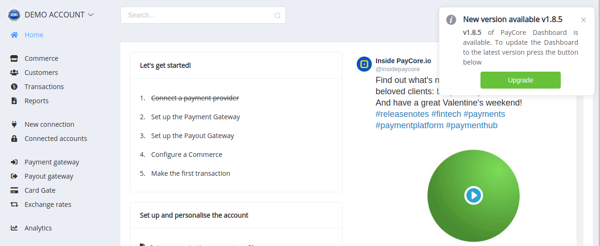
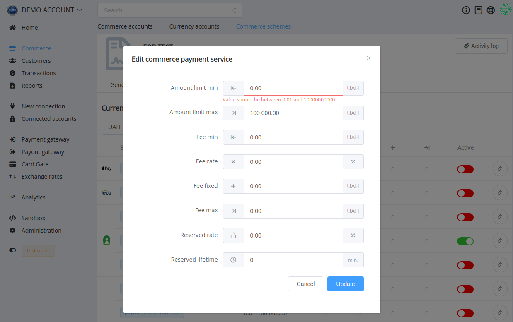

# **PayCore.io v1.8.5 (February 21, 2020)**

*By Dmytro Dziubenko, Chief Technology Officer*

Happy Friday mood from [PayCore.io](https://paycore.io/)!

We keep enhancing our products, and this week our dev team has concentrated on increasing platform productivity. Mostly, the enhancements are under the hood, so these release notes are quite brief.

## Highlights

* [Commerce betterment](#commerce-betterment) in service settings
* [Support of UAX](#support-of-a-new-cryptocurrency)
* [Bug fixes](#bug-fixes)

## List of Changes

### Commerce Betterment

We made a minor improvement in commerce schemes and increased links between services and routing schemes: from now on, minimum and maximum service amounts limits must lie within limits of the related routing scheme.

### Support of a New Cryptocurrency

Yesterday the Ukrainian cryptocurrency trading platform *Kuna* carried out a technical launch of the UAX. New stablecoin is tied to the value of the Hryvnia, and it is currently in the open beta-testing phase for a limited range of consumers of Kuna.io.

But we have also implemented support of UAX in our platform, so you can use it for transactions.

### Bug Fixes

What improvements can be made without fixing previous wrongs? We think so, and put a lot of efforts on the system corrections.

Stay tuned: we are going to please you with the next updates!
